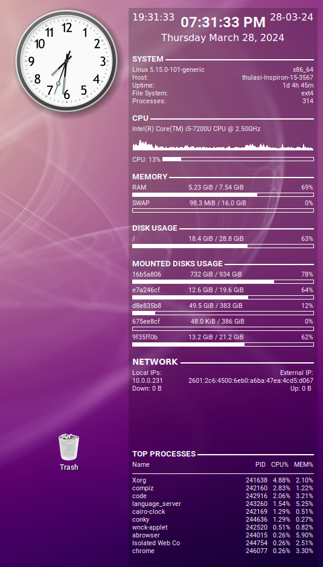
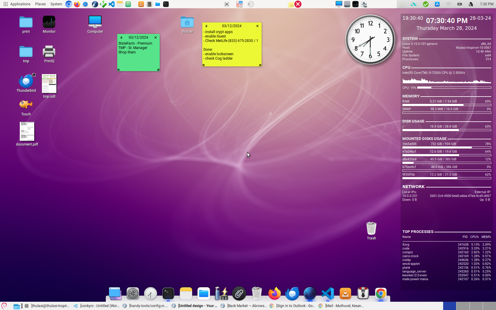

# Customize Your GNOME Desktop

This guide outlines essential steps and tools to customize your GNOME environment after a fresh GNU/Linux installation. While desktop preferences are subjective, this document highlights popular tools to enhance both productivity and aesthetics.

- [Customize Your GNOME Desktop](#customize-your-gnome-desktop)
  - [Desktop Environment Overview](#desktop-environment-overview)
  - [Visual Enhancements & Tools](#visual-enhancements--tools)
    - [Panels](#panels)
    - [Conky System Monitor](#conky-system-monitor)
    - [Plank Dock](#plank-dock)
    - [Compiz Effects](#compiz-effects)
    - [Themes & Icons](#themes--icons)
    - [Fonts](#fonts)
    - [Cairo Clock](#cairo-clock)
    - [Albert Launcher](#albert-launcher)

## Desktop Environment Overview

GNOME and KDE are two of the most popular desktop environments in the Linux ecosystem.

| Feature | GNOME | KDE Plasma |
| :--- | :--- | :--- |
| **Philosophy** | Simplicity, productivity, and modern workflow. | Customization, familiarity, and feature-richness. |
| **Strengths** | Consistent UI, distraction-free interface, high usage in enterprise. | Extensive configuration options, lightweight resource usage. |
| **Toolkit** | GTK | Qt |

While I (the author) have moved through various distributions (like **OpenSuSE** and **Trisquel**), GNOME remains my preferred daily driver for its workflow and integration.

## Visual Enhancements & Tools

Screenshots of the target setup:



### Panels
If you use **MATE panels** or GNOME Flashback, `mate-panel` offers classic customizability. You can add window lists, workspace switchers, and pin favorite apps.
*   **Tip**: For large displays, consider using two panels: one at the top for menus/indicators and one at the bottom for window management.

### Conky System Monitor
[Conky](https://github.com/brndnmtthws/conky) is a lightweight system monitor that renders system information directly on your desktop wallpaper. It can display CPU, memory, disk usage, network stats, and more.
*   **Customization**: Conky is scriptable via Lua and has countless user-created themes available.

### Plank Dock
[Plank](https://launchpad.net/plank) is a strictly simple dock.
*   **Features**: It provides an macOS-style dock for launching and switching applications.
*   **Configuration**: Supports themes ("docklets") to match your desktop aesthetic.
*   **Note**: If you experience issues with dragging icons to the dock, ensure "Lock Icons" is disabled in settings.

### Compiz Effects
Compiz is a compositing window manager famous for its desktop effects (wobbly windows, desktop cube) and window management utilities.

**Installation:**
```bash
sudo apt install compiz-plugins-default compiz-plugins-main compiz-plugins-extra compizconfig-settings-manager
```

**Configuration:**
Run the settings manager to configure effects. **Note:** Run this as your local user, not root, so settings apply to your session.
```bash
ccsm
```

**Recommended Settings:**
*   **Place Windows**: Set Placement Mode to *Centered*.
*   **Effects**:
    *   Enable *Window Decoration* (crucial for window borders/titles).
    *   Enable *Animations*: Try "Magic Lamp" or "Wavy" for minimize/unminimize effects.

> **Pro-Tip:** If window borders disappear, double-check that the *Window Decoration* plugin is enabled and compatible with your window manager.

### Themes & Icons
To apply themes that aren't available in your package manager, you can install them manually.

** Installation Locations:**
*   **User-only (Recommended)**: `~/.themes` for themes and `~/.icons` for icon sets.
*   **System-wide**: `/usr/share/themes` and `/usr/share/icons` (requires `sudo`).

**Recommendations:**
*   **Themes**: McMojave (Light/Solid)
*   **Icons**: Papirus (Light/Dark)

**Manual Configuration:**
You can verify your specific theme configuration in `~/.themes/<theme-name>/index.theme`. It should look similar to:

```ini
[Desktop Entry]
Name=2026-universal
Type=X-GNOME-Metatheme

[X-GNOME-Metatheme]
GtkTheme=Mojave-Light
MetacityTheme=Mojave-Light-solid
IconTheme=Papirus
CursorTheme=Yaru
CursorSize=24
```

### Fonts
For a polished terminal and coding experience, `Powerline` and `Nerd Fonts` are highly recommended.

*   DejaVu Sans Mono for Powerline
*   DejaVu Sans Mono Nerd Font

**Quick Install:**
You can use the following snippet to install a collection of Nerd Fonts:

```bash
sudo apt update && sudo apt install curl -y
curl -sSL https://raw.githubusercontent.com/fam007e/nerd_fonts_installer/main/nerdfonts_installer.sh | bash
```

### Cairo Clock
[Cairo Check](https://macslow.thebiglinux.com/cairo-clock/) provides a high-quality analog clock for your desktop.
*   **Configuration**: Settings are stored in `~/.cairo-clockrc`.
*   **Installation**:
    ```bash
    # Example for Debian/Ubuntu based systems if not in repo
    sudo dpkg -i cairo-clock_*.deb
    sudo apt install -f
    ```
There are situations where you may face issues with `Cairo clock` unable to install due to missing dependencies (E.g., Debian 12 Bookworm / Ubuntu 24.04). This may be due to `libglade2-0` being obsolete and no longer available in the main repositories. Here's a workaround:

You can temporarily **enable the Debian 11 (Bullseye) repository** to install dependencies.

  ```bash
  #1 Create a sources list file for Bullseye
  echo "deb http://deb.debian.org/debian bullseye main" | sudo tee /etc/apt/sources.list.d/bullseye.list
  #2 Update your package list:
  sudo apt update
  #3 Install libglade2-0 and cairo-clock:
  sudo apt install libglade2-0
  #4 Install cairo-clock
  sudo apt install cairo-clock # (or)
  sudo dpkg -i cairo-clock_*.deb # downloaded binary

  # cleanup
  #5 Remove the Bullseye repository to avoid conflicts later:
  sudo rm /etc/apt/sources.list.d/bullseye.list
  #6 Update your package list:
  sudo apt update

  # Troubleshooting
  # Fix Broken Dependencies: If you have broken packages after trying to install, run:
  sudo apt-get install -f
  ```

### Albert Launcher
[Albert](https://albertlauncher.github.io/) is a keyboard-centric launcher (similar to Spotlight on macOS). It indexes your files and applications for instant access.

**Installation:**
```bash
# Example manual install
sudo dpkg -i albert_*.deb
sudo apt install -f
```
