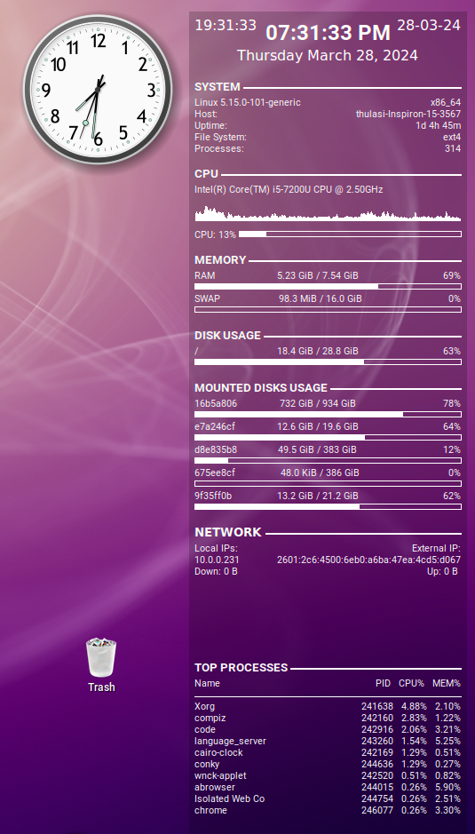
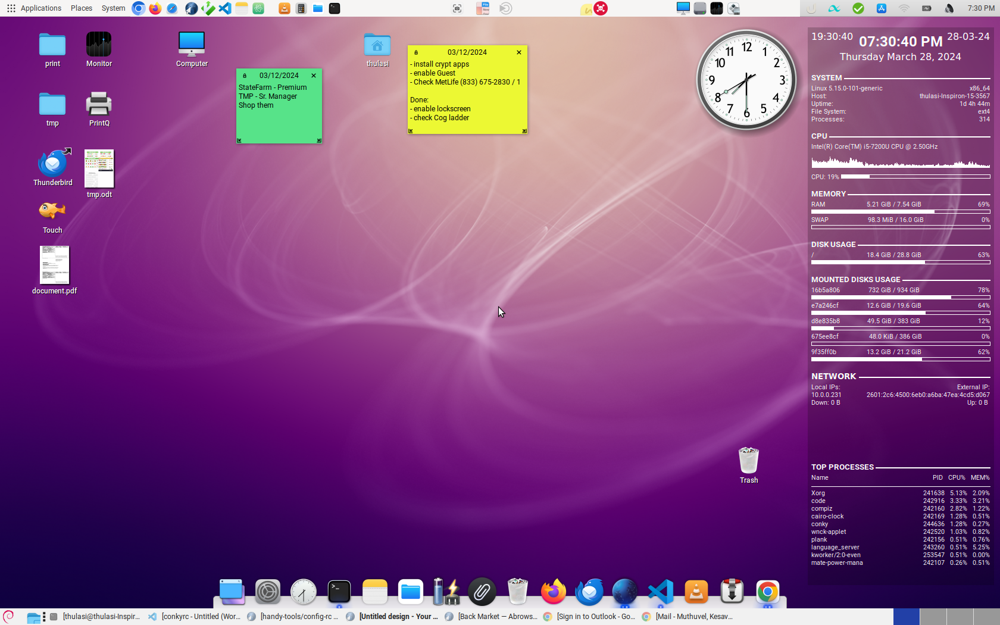

# dotfiles aka Config files
Here's set of dotfiles for my setup. Make sure you grab [find-removable-devices.sh](./find-removable-devices.sh) for `conkyrc`

### Installation

Use [GNU Stow](https://www.gnu.org/software/stow/) to manage your dotfiles:

```bash
# example for ddd
stow -d . -t ~ -v2 ddd

# example for plot
stow -d . -t ~ -v2 -n plot #-n : only simulate
```
### Demo showing conky & cairo-clock



